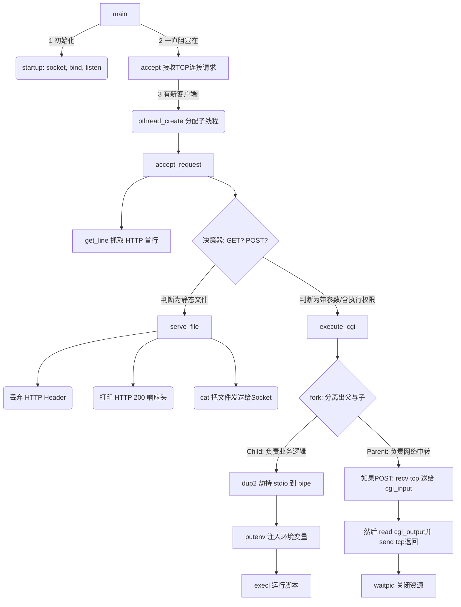

# TinyHTTPd 源码深度学习与架构分析教程

TinyHTTPd 是一份极简的 Web 服务器源代码，由 J. David Blackstone 编写。它包含不到 600 行 C 语言代码，实现了基本的 HTTP 解析、静态文件返回以及动态 CGI 脚本调用等功能。

本教程将带你逐行深入理解其背后的机制，包括 UNIX/Linux 网络编程、Socket 机制、多线程并发操作以及进程间通信（管道、Fork）。

---

## 1. 环境搭建与编译运行步骤

### 1.1 环境适配
代码最初在 1999 年为 Sparc Solaris 编写。在现代 Linux/Unix 系统下编译运行，需要对源代码和构建文件进行微调：
1. **修改 Makefile：**
   原始 Makefile 中使用了 `-lsocket` 选项（Solaris 特有）。在 Linux 下只需引入 `pthread` 库。
   在 `Makefile` 中，修改 `gcc` 命令为：
   ```makefile
   httpd: httpd.c
   	gcc -W -Wall -lpthread -o httpd httpd.c
   ```

### 1.2 编译与运行
在 `18/tinyhttpd-0.1.0/tinyhttpd-0.1.0/` 目录下执行：
```bash
# 1. 编译生成可执行文件 httpd
make

# 2. 运行服务器 (程序会自动绑定一个可用端口并在控制台打印)
./httpd
# 预期输出: httpd running on port 4000 (具体端口号由系统动态分配)
```
服务器运行后，可以通过浏览器访问 `http://127.0.0.1:<port>`。程序默认会寻找同目录下的 `htdocs` 文件夹，并加载里面的 `index.html`。

---

## 2. 核心模块与关键函数深度剖析

整个源码都在 `httpd.c` 中。按功能划分为以下核心模块：

### 2.1 主函数与网络初始化（`main` 与 `startup`）
服务器启动时的核心在于建立 Socket 监听，并采用**多线程**机制来处理并发客户端连接。

**1. `startup(u_short *port)` 模块：**
负责建立 Socket 并绑定端口，如果遇到端口号为0，则让系统随机分配。
```c
int startup(u_short *port)
{
    int httpd = 0;
    struct sockaddr_in name;

    // 1. 创建 TCP Socket (IPv4, 流式套接字)
    httpd = socket(PF_INET, SOCK_STREAM, 0);
    if (httpd == -1) error_die("socket");

    memset(&name, 0, sizeof(name));
    name.sin_family = AF_INET;
    name.sin_port = htons(*port);        // 转换端口为网络字节序
    name.sin_addr.s_addr = htonl(INADDR_ANY); // 监听本机所有网卡 IP

    // 2. 绑定端口
    if (bind(httpd, (struct sockaddr *)&name, sizeof(name)) < 0)
        error_die("bind");

    // 3. 动态端口分配处理
    if (*port == 0)  {
        int namelen = sizeof(name);
        // 如果端口是 0，bind 会动态分配一个。使用 getsockname 获取实际绑定的端口
        if (getsockname(httpd, (struct sockaddr *)&name, &namelen) == -1)
            error_die("getsockname");
        *port = ntohs(name.sin_port); // 更新外部的 port 变量
    }

    // 4. 开始监听，最大排队连接数为 5
    if (listen(httpd, 5) < 0) error_die("listen");
    return(httpd);
}
```

**2. `main()` 模块：采用一对多线程模型。**
```c
int main(void)
{
    int server_sock = -1;
    u_short port = 0;
    int client_sock = -1;
    struct sockaddr_in client_name;
    int client_name_len = sizeof(client_name);
    pthread_t newthread;

    server_sock = startup(&port);
    printf("httpd running on port %d\n", port);

    // 主循环：不断接受新的客户端连接
    while (1) {
        // 阻塞等待客户端连接
        client_sock = accept(server_sock,
                             (struct sockaddr *)&client_name,
                             &client_name_len);
        if (client_sock == -1) error_die("accept");

        // 接收到请求后，开启一个新线程执行 accept_request()，不会阻塞下一个客户端的 accept
        if (pthread_create(&newthread , NULL, accept_request, client_sock) != 0)
            perror("pthread_create");
    }
    close(server_sock);
    return(0);
}
```

### 2.2 请求解析与路由（`accept_request`与`get_line`）
每到来一个 HTTP 请求，就会在一个**新线程**中执行 `accept_request`。

**1. `get_line(int sock, char *buf, int size)` 模块：**
按字符读取，解决平台换行符差异：将CRLF(`\r\n`)、CR(`\r`) 或 LF(`\n`) 统一转换为 `\n`。

**2. `accept_request(int client)` 模块剖析：**
```c
void accept_request(int client)
{
    char buf[1024]; char method[255]; char url[255]; char path[512];
    int cgi = 0;  // 标记位：决定是返回静态文件(0) 还是执行CGI(1)
    
    // 1. 获取 HTTP 请求首行 (如: GET /index.html?id=1 HTTP/1.1)
    numchars = get_line(client, buf, sizeof(buf));
    
    // 2. 提取 Method (GET 或 POST)
    // ... 省略字符串提取代码 ...
    
    // 只处理 GET 和 POST
    if (strcasecmp(method, "GET") && strcasecmp(method, "POST")) {
        unimplemented(client); return;
    }
    
    // 如果是 POST 请求，必然需要 CGI 处理数据
    if (strcasecmp(method, "POST") == 0)
        cgi = 1;

    // 3. 提取 URL，如果 GET 带参数 (有 '?')，则截断参数并置 cgi = 1
    // ... 省略 URL 提取代码 ...
    if (strcasecmp(method, "GET") == 0) {
        query_string = url;
        while ((*query_string != '?') && (*query_string != '\0')) query_string++;
        if (*query_string == '?') {
            cgi = 1;              // GET 带参数也需要 CGI 处理
            *query_string = '\0'; // 截取 URL 到此处结束
            query_string++;       // 游标后移得到完整的 query_string
        }
    }

    // 4. 路由映射：拼凑实际文件路径 (加上 htdocs 目录)
    sprintf(path, "htdocs%s", url);
    if (path[strlen(path) - 1] == '/') strcat(path, "index.html"); // 默认页面

    // 5. 检查文件状态
    struct stat st;
    if (stat(path, &st) == -1) {
        // 文件不存在：读取并丢弃剩余的 HTTP headers，然后返回 404
        while ((numchars > 0) && strcmp("\n", buf)) 
            numchars = get_line(client, buf, sizeof(buf));
        not_found(client);
    } else {
        if ((st.st_mode & S_IFMT) == S_IFDIR) strcat(path, "/index.html"); // 命中目录则访问 index
        
        // 赋予了执行权限的文件，强制开启 CGI
        if ((st.st_mode & S_IXUSR) || (st.st_mode & S_IXGRP) || (st.st_mode & S_IXOTH)) cgi = 1;
        
        // 【核心分支】
        if (!cgi)
            serve_file(client, path); // 静态文件服务
        else
            execute_cgi(client, path, method, query_string); // CGI 执行
    }
    // 6. 处理完毕，关闭连接
    close(client);
}
```

### 2.3 静态资源处理（`serve_file`）
当所求的是普通静态网页、图片等内容时调用。
它会把客户端发来的剩余 Header 丢弃（避免堆积），接着打印 200 OK 头，最后由 `cat()` 函数通过 `fgets` 及 `send()` 一行行将资源内容发给客户端。

### 2.4 CGI 动态执行模块（`execute_cgi`）—— 【重点精读】
这部分是 UNIX 进程间通信（IPC）的绝佳展示。为了让 HTTP Server 把 Socket 收到的 POST 参数交由独立的外部脚本处理，并拿到外部脚本的输出结果，采用了一对**匿名管道 (Pipe)**。

```c
void execute_cgi(int client, const char *path, const char *method, const char *query_string)
{
    int cgi_output[2]; // 子进程的输出管道
    int cgi_input[2];  // 子进程的输入管道
    pid_t pid;

    // 1. 如果是 POST，解析头部找出 Content-Length (知道要读多少字节的 Request Body)
    if (strcasecmp(method, "POST") == 0) {
        // ... get_line 解析 Content-Length ...
    }

    // 回复 HTTP/1.0 200 OK 的响应首行
    sprintf(buf, "HTTP/1.0 200 OK\r\n");
    send(client, buf, strlen(buf), 0);

    // 2. 建立两条管道（管道是单向的，为了完成父子进程互相通信，必须建两条）
    if (pipe(cgi_output) < 0 || pipe(cgi_input) < 0) {
        cannot_execute(client); return;
    }

    // 3. 核心：fork 派生子进程执行脚本
    if ( (pid = fork()) < 0 ) {
        cannot_execute(client); return;
    }
    
    // =============== 子进程区域 ===============
    if (pid == 0) { 
        // 关键操作：重定向标准输入流(0)和标准输出流(1)
        // 让脚本程序的 printf 直接输出到 cgi_output 管道
        // 让脚本程序的 scanf 直接从 cgi_input 管道读取
        dup2(cgi_output[1], 1); 
        dup2(cgi_input[0], 0); 
        
        // 子进程只读/写一端，关闭无用的端点
        close(cgi_output[0]); close(cgi_input[1]);
        
        // 设置注入给 CGI 脚本的环境变量
        sprintf(meth_env, "REQUEST_METHOD=%s", method); putenv(meth_env);
        if (strcasecmp(method, "GET") == 0) {
            sprintf(query_env, "QUERY_STRING=%s", query_string); putenv(query_env);
        } else {
            sprintf(length_env, "CONTENT_LENGTH=%d", content_length); putenv(length_env);
        }
        
        // execl 替换进程映像，执行外部 CGI 程序
        execl(path, path, NULL);
        exit(0);
    } 
    // =============== 父进程(HTTP 服务器线程)区域 ===============
    else { 
        close(cgi_output[1]); close(cgi_input[0]); // 父进程关闭另外两端
        
        // 1) 如果是 POST，父进程从客户端 Socket 接收 Body，并写进 cgi_input 管道灌给子进程
        if (strcasecmp(method, "POST") == 0)
            for (i = 0; i < content_length; i++) {
                recv(client, &c, 1, 0);
                write(cgi_input[1], &c, 1);
            }
            
        // 2) 父进程从 cgi_output 管道读取子进程的执行结果，立刻套接发给 客户端
        while (read(cgi_output[0], &c, 1) > 0)
            send(client, &c, 1, 0);

        // 清理现场：关闭管道，并等待子进程结束防僵尸进程
        close(cgi_output[0]); close(cgi_input[1]);
        waitpid(pid, &status, 0);
    }
}
```

---

## 3. 关键函数的调用关系与数据流分析

### 3.1 核心调用图谱 (Mermaid 架构图)



### 3.2 CGI POST 请求数据流向精解
这是最复杂但也是最巧妙的地方。数据的流向是一条曲折的管道：
1. **客户端数据 -> 服务器：** 父进程线程（也就是当前的 HTTP 处理线程）通过 `recv` 从 `client_sock` 中拉取客户端提交过来的一段长表单数据。
2. **服务器 -> 子进程（CGI）：** 父进程执行 `write(cgi_input[1], ...)`，将接收的信息放入管道的写入端。因为子进程启动时通过 `dup2(cgi_input[0], 0)` 劫持了标准输入，故而外部的 `.cgi` 或 `.py` 脚本只要调用普通的 `scanf()`，读取到的就是管道里的客户端表单！
3. **子进程（CGI） -> 服务器：** 脚本处理完毕，用 `printf("<h1>Done</h1>")` 准备返回页面。由于 `dup2(cgi_output[1], 1)` 的存在，printf 吐出的字符全部流进第二根管道 `cgi_output`。
4. **服务器 -> 客户端：** 父进程此时正阻塞在 `read(cgi_output[0], &c, 1)` 上，一旦子进程有输出，父进程就会立刻读出并执行 `send(client, &c, 1, 0)` 推入网络，直到客户端的浏览器呈现网页。

---

## 4. 架构设计与性能改进思考

通过阅读并掌握这 500 多行的代码，我们能轻易看出这个诞生于二十多年前的微型项目的架构瓶颈和不足。请思考以下 3 个问题，以帮助巩固现代 Web 服务器开发思维：

### 🛠️ 思考题 1：高并发架构设计的瓶颈
**原理解析：** TinyHTTPd 采用了 **"One Thread Per Connection" (一连接一线程)** 模型。每次 `accept` 请求瞬间就 `pthread_create` 开启一个新的线程。
**思考问题：**
如果面对 C10K（同时有一万个并发连接），系统不断创建线程会导致什么后果？如果你要彻底重构这段代码提升它的高并发上限，你会引入哪种新的 I/O 多路复用机制？
*提示方向：分析线程上下文切换（Context Switch）的开销，内存耗尽风险。可以考虑改造为 Nginx 广泛使用的 Epoll 或 Kqueue 配合 Reactor 异步非阻塞模型，也可以退而求均使用线程池 (Thread Pool)。*

### 🛠️ 思考题 2：安全漏洞与防御（Buffer Overflow）
**原理解析：** 仔细观察下辖这段 C 代码：
```c
char buf[1024]; char method[255]; char url[255];
sprintf(path, "htdocs%s", url);
```
**思考问题：**
这里存在着典型的缓冲区溢出风险以及路径非法穿越的高危漏洞。如果一个恶意访客发来了一个长度超过 1024 字节的方法名，或者发来的 URL 中带有 `../../etc/shadow`，服务器系统会发生什么情况？你该如何为 TinyHTTPd 添加安全防护代码？
*提示方向：使用更为安全的字符串库函数：如 `snprintf`、`strncpy` 替代 `sprintf`、`strcpy`。同时检查 url 变量必须拦截含有 `..` 这种上级目录跳转命令的行为，防止后台系统文件被任意下载。*

### 🛠️ 思考题 3：HTTP/1.1 长连接（Keep-Alive）的适配
**原理解析：** 现有的 `accept_request()` 函数在结束时立刻无条件执行 `close(client)` 断开了 TCP 连接，这是老旧的 HTTP/1.0 协议标准短连接特征。
**思考问题：**
频繁的三次握手与四次挥手代价很大，为了适配当今的主流 HTTP/1.1 `Connection: Keep-Alive` 持久连接功能，`httpd.c` 源码需要在整体控制流和读取流代码上面临多大的结构性改动？
*提示方向：服务器必须开始解析请求头里的 `Connection` 字段，并在主循环机制内让该 `client_sock` 保持打开状态（放入待观察队列中或线程不退出转而死循环监听该 fd 重新等待下一次 HTTP Header 到来）。必须精确通过 `Content-Length` 读取防止死锁读，以及处理空闲超时自动踢出的保活机制。*